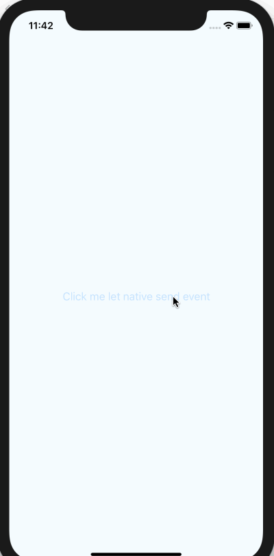

# React Native Event

React Native event emitter with callback on both Android & iOS.

Sometimes we send event to javascript and want to execute some native codes with javascript result, we have to write lots of template codes, so this library provide the ability to send event with callback.

[](https://npmjs.org/package/rn-event-emitter-callback) [](https://npmjs.org/package/rn-event-emitter-callback) [](https://npmjs.org/package/rn-event-emitter-callback)

# iOS Screenshot



# Android Screenshot


# Build and run the demo

```shell
$ cd RNEventDemo/
$ yarn install
$ react-native run-ios # or react-native run-android
```

# Setup

#### Install:

```shell
$ yarn add rn-event-emitter-callback
```

#### iOS:

* You must be consuming React itself via [CocoaPods](https://cocoapods.org/) for this to work, see [React Native documentation](https://facebook.github.io/react-native/docs/integration-with-existing-apps) on how to set that up.

* Add the following to your `Podfile` and run `pod update`

  ```
  pod 'ReactEventEmitter', :path => '../node_modules/rn-event-emitter-callback/Source/ios/'
  ```

#### Android：

* Edit `android/settings.gradle` to look like this (without the +):

  ```diff
  rootProject.name = 'MyApp'

  include ':app'

  + include ':ReactEventEmitter'
  + project(':ReactEventEmitter').projectDir = new File(rootProject.projectDir, '../node_modules/rn-event-emitter-callback/Source/android')
  ```

* Edit `android/app/build.gradle` to look like this:

  ```diff
  apply plugin: 'com.android.application'

  android {
    ...
  }

  dependencies {
    implementation fileTree(dir: "libs", include: ["*.jar"])
    implementation "com.android.support:appcompat-v7:${rootProject.ext.supportLibVersion}"
    implementation "com.facebook.react:react-native:+"  // From node_modules
    implementation 'org.greenrobot:eventbus:3.1.1'
  + implementation project(':ReactEventEmitter')
  }
  ```


* Edit `MainApplication.java` to look like this:

  ```diff
  package com.myapp;

  + import me.tom.react.event.ReactEventEmitterPackage;

  ....

    @Override
    protected List<ReactPackage> getPackages() {
      return Arrays.<ReactPackage>asList(
        new MainReactPackage()
  +   , new ReactEventEmitterPackage()
      );
    }

  }
  ```


# Demo

* [JavaScript](RNEventDemo/App.js#L14-L25)
* [iOS](RNEventDemo/ios/RNEventDemo/AppDelegate.m#L53-L60)
* [Android](RNEventDemo/android/app/src/main/java/com/rneventdemo/MainActivity.java#L45-L53)

# API

#### JavaScript

```javascript
ReactEventEmitter.addListener(name, { params, callback });
ReactEventEmitter.removeListener(name);
```

#### iOS

```objc
- (void)sendEvent:(RCTBridge *)bridge name:(NSString *)name;
- (void)sendEvent:(RCTBridge *)bridge name:(NSString *)name
           params:(id)params;
- (void)sendEvent:(RCTBridge *)bridge name:(NSString *)name
         callback:(ReactEventEmitterCallbackHandler)callback;
- (void)sendEvent:(RCTBridge *)bridge name:(NSString *)name
           params:(id)params
         callback:(ReactEventEmitterCallbackHandler)callback;
```

#### Android

```java
public void sendEvent(ReactContext context, String name);
public void sendEvent(ReactContext context, String name, @Nullable Object params);
public void sendEvent(ReactContext context,
                      String name,
                      @Nullable ReactEventEmitterCallbackHandler callbackHandler);
public void sendEvent(ReactContext context,
                      String name,
                      @Nullable Object params,
                      @Nullable ReactEventEmitterCallbackHandler callbackHandler);
```

# Note

The callback is run in main thread.

# License

[MIT](LICENSE)
